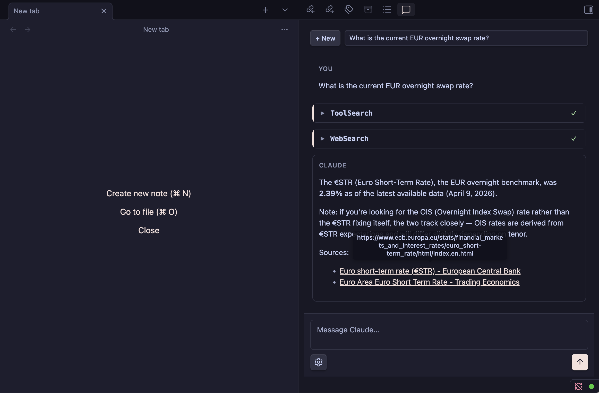

# Obsidian Clawbar

A plugin that aims to replicate a native Claude Code chat UI, similar to the Visual Studio Code plugin.

## Features
- Native chat UI (not just a terminal wrapper)
- Multi-account support
- Awareness of current active note
- Polished permission and question prompts with smooth animations
- Interactive tool use visualization with collapsible sections
- Markdown rendering for assistant responses
- Conversation persistence across sessions